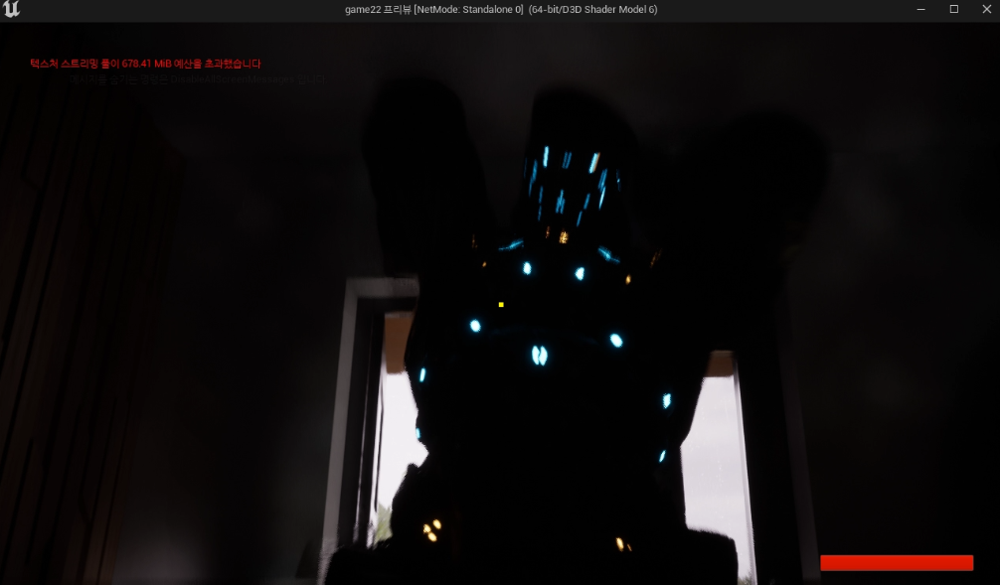
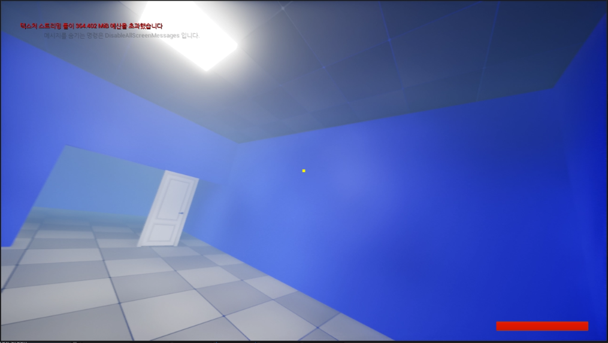
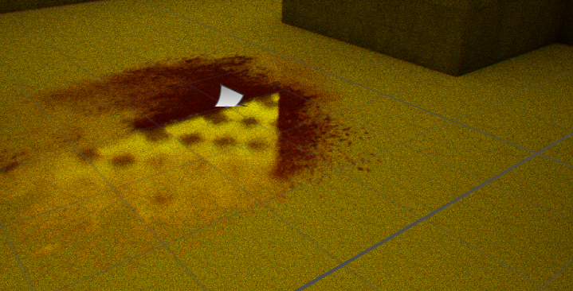

# [목차]
1.[프로젝트명 : Exit Beyond Fear](#프로젝트명-Exit-Beyond-Fear)  
2.[컨셉](#컨셉)  
3.[컨셉 & 대표이미지 기반 작품묘사](#컨셉--대표이미지-기반-작품묘사)  
4.[게임 시스템 디자인](#게임-시스템-디자인)  
5.[게임의 규칙](#6-게임의-규칙)  
6.[개발 요구사항 & 흐름도](#개발-요구사항--흐름도)  
7.[프로토타입 개발작업 일정 (13주개발)](#프로토타입-개발작업-일정-13주개발)  

# 프로젝트명: Exit Beyond Fear(배용훈)

# [컨셉]

## 메인컨셉 : 절망적인 탈출

- 게임의 핵심은 플레이어가 어둠과 공포로 가득한 환경에서 끝없는 공포에서 탈출한다.  

### 서브 컨셉 1 : 바디캠

- 바디캠으로 활용해 현실적이게 표현한다.  

### 서브 컨셉 2 : 방해물과 함정  

- 플레이어는 트랩과 미로 같은 장애물을 피하거나 이를 활용하여 탈출해야 한다.  

### 서브 컨셉 3 : jump scare

- 갑툭튀로 플레이어를 공포를 조성한다.

### 서브 컨셉 4 : 소리와 음악  

- 게임 내 음향 요소를 최대한 활용하여 플레이어에게 공포와 긴장감을 전달한다.  

  

# [관련 이미지 & 동영상]  
- 이미지  
  
   

  

# [컨셉 & 대표이미지 기반 작품묘사]

> ### 대표이미지 기반 :  
- 플레이어는 바디캠을 착용한 상태에서 게임을 시작하고 탈출하는게 목표입니다.  

> ### 컨셉 기반:
- 플레이어는 스토리를 진행하면서 함정과 미로를 피해다니면서 탈출하는게 목표입니다.  
  

# [게임제목 구성 요소]

- 플레이어에게 공포와 스릴을 경험하며 게임 내에서 공포 요소를 극대화하고 탈출을 하는 게임이다.  

 

## 1. 메커니즘

[도전 과제]

1) 스토리를 진행하면서 탈출한다.  

[재미 요소]

1) 스릴과 재미를 얻을 수 있다.  
2) 간단한 스토리의 재미를 얻는다.  
3) 공포를 조성하는 소리와 음악을 느끼게하여 좀 더 긴장감을 느낄 수 있게 한다.  

 

## 2. 이야기

[만들게 된 배경]  
공포게임을 플레이하면서 느낄 수 있는 스릴감이 좋다고 생각하여 이번에도 공포게임을 만들게 되었습니다. 요즘에 유행하는 바디캠을 활용하는 게임들이 나와서 저도 이번에 바디캠을 활용한 게임을 만들면 좋겠다는 생각이 들었습니다.  

[카메라 관점]  
1인칭 형식의 바디캠을 장착한 형식으로 좀 더 현실적이게 게임 플레이를 할 수 있습니다.  
 

## 3. 미적요소

[디자인]  
3D형식으로 오브젝트로 공포를 조성하는 맵 환경을 만든다.
[컬러]  
어둡게하여 밤 이라는 시간을 만든다.
[음향]  
조용한 분위기의 음향이다가 작은 소리에 민감하게 들리는 음향과, 흥미진진 해졌을 때 긴박한 음향을 만들 예정입니다.
   

# [게임 시스템 디자인]
## 1. 게임 오브젝트 분해  

|연번|오브젝트 이름(영문이름)|오브젝트 이미지|
|:---:|:---:|:---:|  
|1|사람(Player)||  
|2|문(door)||  
|3|몬스터1(monster1)||  
|4|몬스터2(monster2)||  
|5|노트(note)||  
|6|비(Rain)||  
|6|체력(HP)||  

## 2. 파라미터(속성) 뽑아 보기
1) 오브젝트 이름: player  

|속성|영문명칭|설명|비고|
|:---:|:---:|:---:|:---:|
|속도|Player_S|플레이어 이동속도|.|
|상태|Player_T|플레이어의 스테미너 상태|.|

2) 오브젝트 이름: Monster1  

|속성|영문명칭|설명|비고|
|:---:|:---:|:---:|:---:|
|속도|M1_sp|몬스터 이동속도|.|
[공격]M1_At|몬스터 공격데미지|.|
2) 오브젝트 이름: Monster2 

|속성|영문명칭|설명|비고|
|:---:|:---:|:---:|:---:|
|속도|M2_sp|몬스터 이동속도|.|

## 3. 행동 뽑아 보기
1) 오브젝트 이름: player  

|행동|영문 명칭|설명|
|:---:|:---:|:---:|
|앞으로 이동|front_move|플레이어가 앞으로 이동|
|뒤로 이동|back_move|플레이어가 뒤로 이동|
|왼쪽 이동|left_move|플레이어가 왼쪽으로 이동|
|오른쪽 이동|right_move|플레이어가 오른쪽으로 이동|
|앉기|sit|플레이어 앉기|
|뛰기|run|플레이어 뛰기|
|빛 비추기|light_on|플레이어가 빛을 비추기|
|빛 끄기|light_off|플레이어가 빛을 끄기|
|상호작용|action|플레이어가 아이템을 문 상호작용|

## 6. 게임의 규칙

1) 핵심 규칙  
플레이어는 몬스터 피해 탈출을 한다.
WASD로 상하좌우 이동

2) 보조 규칙  
플레이어는 총을 쏘거나 도망다닌다.

# [개발 요구사항 & 흐름도]
## 1. 요구사항
플레이어가 탈출 할 수 있는 맵 구현  
도착지점 구현  
플레이어 구현  
바디캠 화면 구현  
몬스터(적)구현  
상호작용 구현  
플래시 구현  
jump scare 구현  
밤 구현  
설정 구현  
체력 구현  
적 체력 구현  
적 죽을 시 애니메이션 구현  
잡혔을 때 연타로 그로기 상태에 빠지는 것 구현  
편지 구현  
방안 텍스쳐 구현  
postproessvloume 먼지효과, vhs효과 구현  
그래비티 조형 구현  
트리거 지나가면 소리나는 효과 구현    
지형에 따라 다르게 소리나는 플레이어 발소리  
메인, 설정, 끝내기 구현  
게임 일시정지, 되돌아가기, 설정, 끝내기, 구현  
총 구현  
총 헤드, 바디에 따라 적 체력이 닳는 정도를 다르게 구현  
총에 맞을시 파티클 효과 구현  
다른 스테이지로 가는 시퀀스 구현  
크로스헤어  

# [프로토타입 개발작업 일정 (13주개발)]
## 1주차
### 주제 정하기  

## 2주차
### 바디캠 구현  
### 앉기, 뛰기, 구현  
  

## 3주차  
적 AI구현  
  

## 4주차  
### 연타 이벤트 구현
  

#### 성공시에  
 

#### 실패시  
  

## 5주차
### 총에 맞을시 ai가 피가 줄어드는 구현  
### 적 체력이 다 할시 죽는것 구현  
### 적이 플레이어한테 공격하는 것 구현  
  
  
  

## 6주차
### 시퀀스에 연타기능을 넣어보려고 했으나 실패.  

## 7주차  
### 중간고사 기간  

## 8주차
### 중간 보고서  

## 9주차
### 모델링 변경  

  

## 10주차
### 랜드스케이프 맵 구현  
  

## 11주차
### 랜드스케이프 맵에 집 구현  
  

## 12주차
### 애니메이션 수정, 적 있는곳에 발소리 효과음 구현, 타격소리 구현  

  

### 시퀀스 2개 구현  

  
  
  
맵 추가 구현  
  

## 13주차
### 맵 추가 구현  
  

### jumpscare 구현  
  

### 총 구현  
  

### 총을 적에게 맞출시 파티클 효과 구현  
  

### 헤드, 몸통부위를 나눠 적용되는 데미지 구현  

## 14주차
### 스킵버튼 구현  
  

### 편지를 볼 수 있는 오브젝트 구현  
  

### 방안 텍스쳐 수정  
  
  

### postprocessvloume 효과의 먼지 효과와 vhs효과 구현  
  

### 그래비티, 피 조형 구현  
  
  
  

### 트리거를 밟게 되면 소리나는 효과 구현  
  
  

### 플레이어가 지형에 따라 다르게 소리나는 효과 구현  
  

### 메인화면, 정지, 설정, 끝내기 효과 구현   
  
  
  

### 마지막 도착지점 구현  
  

## 15주차
### 기말고사 기간  

## 16주차
### 기말고사 보고서

